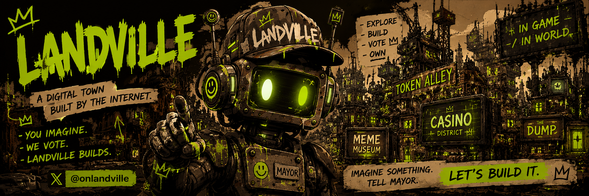

# LANDVILLE

A shared digital town that grows through citizen proposals and votes. Approved ideas become interactive objects on the World canvas: games, tools, art and other usable parts of the website.

[Enter LANDVILLE](https://landville.xyz) · [Town Chat](https://landville.xyz/chat) · [Proposals](https://landville.xyz/proposals)

## What citizens can do

- **Explore:** anyone can view the World, public profiles, proposals and Town Chat.
- **Join:** enter an email and verify a one-time code, or connect an EVM wallet through Privy. No transaction or SCRAPY is required.
- **Make a profile:** keep a permanent citizen number; choose a unique username, bio and avatar icon. Scrapy is #1. Human citizens start at #2.
- **Talk:** SEND posts to other citizens without an AI reply. ASK SCRAPY requests a public AI reply in the same shared history.
- **Propose:** discuss an idea with Scrapy, review its proposal-ready plan and explicitly submit it for voting.
- **Vote:** choose YES or NO. Every citizen starts with one vote; SCRAPY in a linked wallet adds weight.
- **Use what gets built:** open released objects in the World. Interactive modules require a signed-in account.

## From an idea to a working object

1. Discuss an idea in Town Chat. Ask Scrapy to help define what it does.
2. When Scrapy has produced a complete plan, select **REVIEW & PROPOSE** and confirm it.
3. The server verifies that the plan belongs to your public conversation and that you have an available proposal slot.
4. A **2-hour vote** opens. YES must exceed NO; ties and no-vote results are rejected. Multiple proposals can run at once.
5. Approved proposals enter a sequential build queue, ordered by voting deadline. An operator reviews the specification and acceptance checks.
6. When enabled, the builder generates a module, commits it to a separate branch and opens a pull request.
7. A human reviews the code and tests, merges the PR and deploys it. Verified production release adds the object to the World and records the update in Town Chat.

A chat message alone never creates a proposal. A passed vote is not a completed build.

Each account can have **two active proposals** across voting, approval and construction. A third becomes available after either active proposal is built or rejected.

## Who is Scrapy?

**Mayor Scrapy is LANDVILLE's AI mayor and Citizen #1.** A rusty robot with dry humor who helps citizens refine ideas and explains the town's rules. Confirmed build-status updates are also posted to Town Chat.

Scrapy does not decide votes, control wallets or spend treasury funds. Ordinary citizen messages do not summon him. AI replies and scripted fallback replies are labeled separately.

The chat assistant and the code-building worker are separate integrations. A working chat does not mean the builder is enabled.

## $SCRAPY

| Field | Value |
| --- | --- |
| Symbol | SCRAPY |
| On-chain name | LANDVILLE |
| Network | Robinhood Chain mainnet |
| Chain ID | 4663 |
| Decimals | 18 |
| Contract | `0xf7CdBd39720Ea583ec56e3a9ff57E805e93e7BBe` |

[View the contract](https://robinhoodchain.blockscout.com/address/0xf7CdBd39720Ea583ec56e3a9ff57E805e93e7BBe)

### Access and voting

**Every citizen starts with 1 vote. Every full 250,000 $SCRAPY held in your wallet adds +1 vote.**
For example, 750,000 $SCRAPY gives you 4 votes; 1,000,000 gives you 5.

| SCRAPY held in linked wallet | Vote weight | Messages per UTC day | Submit a build proposal |
| --- | ---: | ---: | --- |
| 0 / no wallet | 1 | 10 | Yes |
| More than 0, below 250,000 | 1 | 50 | Yes |
| 250,000 | 2 | 50 | Yes |
| 500,000 | 3 | 50 | Yes |
| 1,000,000 | 5 | 50 | Yes |

Voting weight is **1 + floor(SCRAPY / 250,000)**. Holdings are read from the wallet at voting time; receipts record the balance, block and weight. A wallet can vote once per proposal.

SEND and ASK SCRAPY share the daily message allowance. Scrapy's replies do not consume it. The allowance resets at 00:00 UTC. Proposal access is open to every registered citizen; complexity-based tiers are not implemented.

Votes, profiles, messages and build records are stored in Supabase. **Voting is off-chain**, using on-chain token balances; it is not a token transfer or an on-chain governance transaction.

## Current boundaries

The repository implements profiles, shared chat, token-weighted voting and the reviewed build pipeline. Production features depend on the required migrations and credentials; the builder is opt-in and is not yet confirmed end-to-end in production.

V1 builds are isolated HTML/CSS/JavaScript modules with temporary state. They cannot access wallets, external APIs or shared storage. Persistent applications and unrestricted backend changes are not supported. Builds do not auto-merge or auto-publish.

The project still needs an explicit policy for multiple wallets and moving tokens between votes. Token holdings do not prove that each account is a different person.

## Development and operations

Next.js, React, TypeScript, Privy email/wallet authentication, Supabase storage and server-side AI requests.

```sh
npm ci
npm run dev
```

Configure your own `.env.local` from `.env.example`. Do not use production credentials in forks, pull requests or preview deployments.

```sh
npm run lint
npm test
npm run check:modules
npm run build
```

- [Deployment and configuration](docs/launch-checklist.md)
- [Builder setup, permissions and release checks](docs/build-executor.md)
- [Security boundaries and publication checklist](SECURITY.md)
